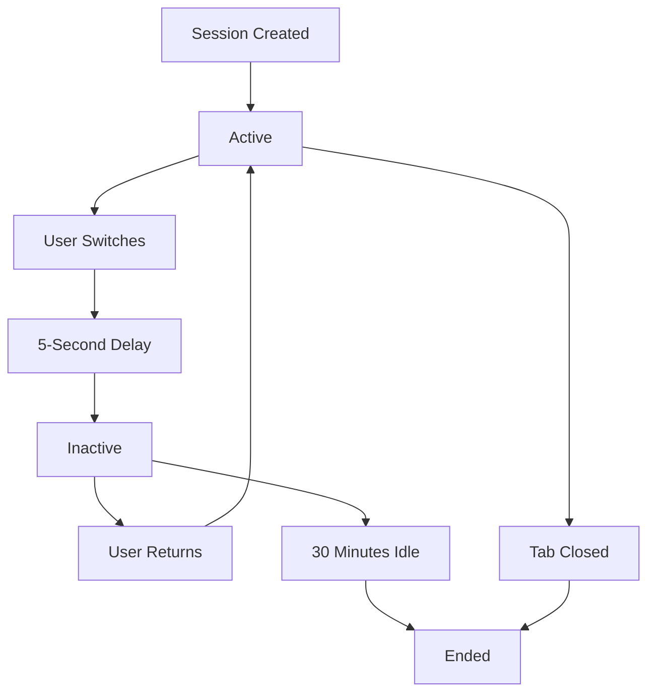

# User Tracking System Documentation

## Overview

The User Tracking system provides real-time monitoring of user sessions and activity across the application. It features a simplified session state management system with provisioned guest support and a clean three-group UI structure for optimal user experience.

## Key Features

### Session State Management System
- **State Transitions**: Sessions use `active`, `inactive`, `idle`, and `ended` states instead of aggressive deletion
- **Provisioned Guest Management**: 1 guest per browser tab with proper persistence
- **5-Second Transition Delays**: Smooth transitions between user types
- **Session Persistence**: Sessions survive browser refreshes and tab switches

### Enhanced User Interface
- **Three-Group Structure**: Registered Users, Active Provisioned Guests, Inactive Provisioned Guests
- **Consistent Card Design**: All user types use the same SessionCard component
- **Dev Theme Integration**: Consistent zinc/slate color scheme throughout
- **Real-time Updates**: Live session data with 2-second polling

## Architecture

### Core Components

```
┌─────────────────────────────────────────────────┐
│           SessionManager Service                │
│  - Singleton pattern for shared session stores │
│  - Handles cleanup and state management         │
└─────────────────────────────────────────────────┘
                          ↓
┌─────────────────────────────────────────────────┐
│         GlobalSessionProvider                   │
│  - Session lifecycle management                 │
│  - Provisioned guest coordination               │
│  - State transition handling                    │
└─────────────────────────────────────────────────┘
                          ↓
┌─────────────────────────────────────────────────┐
│          User Tracking UI                       │
│  - Three collapsible groups                     │
│  - Unified SessionCard components               │
│  - Real-time activity display                   │
└─────────────────────────────────────────────────┘
```

### Session State Flow



## Implementation Details

### Provisioned Guest Management

**Requirements Implemented:**
1. **One guest per browser tab maximum**
2. **Guest persistence until tab close** (not deleted on user switching)
3. **Active/inactive state transitions** instead of deletion
4. **5-second transition delays** for smooth user experience
5. **UI synchronization** between profile switcher and session tracking

**Guest Persistence Strategy:**
```javascript
// sessionStorage for tab-specific guest
const PROVISIONED_GUEST_KEY = 'provisioned_session_guest';

// Store guest with session metadata
sessionStorage.setItem(PROVISIONED_GUEST_KEY, JSON.stringify({
  id: guestId,
  name: guestName,
  profilePicture: avatar,
  preferences: {
    sessionId: sessionId,
    fingerprint: browserFingerprint,
    theme: theme
  }
}));
```

### Session Card Component

**Unified Design:** All tracked users use the same `SessionCard` component with:
- **Header**: Avatar, name, session time, event count
- **Details**: Browser info (shortened), routes with real-time activities
- **Layout**: Two-column structure with vertical divider
- **Theming**: Consistent dev theme colors (zinc/slate)

**Card Structure:**
```
┌─────────────────────────────────────────────────┐
│ [Avatar] User Name        [🕒] 2h 15m           │
│ Status                    [#] 7 events          │
├─────────────────────────────────────────────────┤
│ [Browser] Chrome on macOS │ Last Activity       │
│ [Route] Multiple routes   │ [⚡] Button Click   │
│ - /dev/user-tracking     │ 2m ago              │
│ - /dev/convos            │                     │
├─────────────────────────────────────────────────┤
│ ID: session-123...                              │
└─────────────────────────────────────────────────┘
```

### Three-Group UI Structure

**1. Registered Users**
- All registered user sessions
- Combined session data for multiple routes
- Blue-bordered group header

**2. Active Provisioned Guests**
- Provisioned guests with status 'active'
- Green indicator, auto-expanded
- Real-time activity tracking

**3. Inactive Provisioned Guests**
- Provisioned guests with status 'inactive'
- Yellow indicator, collapsed by default
- Maintains session history

### State Transition API

**Endpoint:** `POST /api/sessions/transition`

```javascript
// Request body
{
  "userId": "guest_123456789",
  "newStatus": "inactive",
  "reason": "switched_to_registered_user"
}

// Transitions handled:
// - registered_user → guest_mode (after 5s delay)
// - guest_mode → registered_user (after 5s delay)
// - tab_closed → ended (immediate)
// - idle_timeout → inactive (after 30min)
```

## Event Tracking

### Tracked Event Categories

1. **Navigation Events**: `page_view`, `route_change`
2. **Board Events**: `card_created`, `card_updated`, `card_moved`, `card_flipped`
3. **UI Events**: `button_clicked`, `dialog_opened`, `dialog_closed`
4. **Session Events**: `session_start`, `session_end`, `user_switched`
5. **Settings Events**: `theme_changed`, `animation_toggled`

### Event Flow Pipeline

1. **Component Action** → Event emission
2. **SessionTracker** → Event batching (10 events or 500ms)
3. **API Endpoint** → `/api/sessions/events` receives batch
4. **Event Store** → In-memory storage with session association
5. **User Tracking UI** → Real-time display with 2s polling

## API Endpoints

### Session Management
- `GET /api/sessions` - Retrieve all sessions grouped by user type
- `POST /api/sessions` - Create or reuse session with intelligent logic
- `PATCH /api/sessions/transition` - Handle state transitions
- `DELETE /api/sessions/[id]` - End specific session

### Event Tracking
- `POST /api/sessions/events` - Batch event submission
- `GET /api/sessions/events` - Retrieve events with filtering

### Session Simulation
- `POST /api/sessions/simulate` - Create test sessions
- `PATCH /api/sessions/simulate/activity` - Control auto-activity
- `DELETE /api/sessions/simulate` - Remove simulated sessions

## Key Files

### Core Implementation
- `/lib/services/session-manager.js` - Singleton session store
- `/lib/contexts/GlobalSessionProvider.jsx` - Session context
- `/lib/hooks/useGuestUsers.js` - Guest user management
- `/lib/services/session-tracker.js` - Client-side tracking

### UI Components
- `/app/dev/user-tracking/page.jsx` - Main tracking dashboard
- `/components/ui/session-card.jsx` - Unified session display
- `/components/ui/session-group.jsx` - Collapsible group headers
- `/components/ui/activity-timeline.jsx` - Event timeline

### API Routes
- `/app/api/sessions/route.js` - Session CRUD operations
- `/app/api/sessions/transition/route.js` - State transitions
- `/app/api/sessions/events/route.js` - Event ingestion

## Configuration

### Session Constants
```javascript
// lib/utils/session-constants.js
export const SESSION_STATUS = {
  ACTIVE: 'active',
  INACTIVE: 'inactive', 
  IDLE: 'idle',
  ENDED: 'ended'
};

export const SESSION_CONFIG = {
  BATCH_SIZE: 10,
  BATCH_TIMEOUT: 500,
  IDLE_TIMEOUT: 5 * 60 * 1000,
  INACTIVE_TIMEOUT: 30 * 60 * 1000
};
```

### Theme Integration
```javascript
// All components use dev theme colors
import { THEME } from '@/lib/utils/ui-constants';

// Backgrounds: THEME.colors.background.secondary
// Borders: THEME.colors.border.primary  
// Text: THEME.colors.text.primary/secondary/tertiary
```

## Debugging

### Common Commands

```bash
# View all sessions with states
curl -s http://localhost:3000/api/sessions | \
  jq '.guests[] | {id: .id, name: .userName, status: .status, provisioned: .metadata.provisioned}'

# Check transition events
curl -s "http://localhost:3000/api/sessions/events?limit=20" | \
  jq '.events[] | select(.type == "session_status_changed")'

# Test session creation
curl -X POST http://localhost:3000/api/sessions \
  -H "Content-Type: application/json" \
  -d '{"userId": "test-user", "userType": "guest", "metadata": {"provisioned": true}}'
```

### Browser Console Debugging

```javascript
// Check session sync
console.log('Current user:', currentUser);
console.log('Provisioned guest:', provisionedGuest);
console.log('Session state:', currentSession);

// Verify localStorage
localStorage.getItem('provisioned_guest_data');
sessionStorage.getItem('provisioned_session_guest');
```

## Best Practices

### Session Management
1. **Use stable IDs** for cross-tab persistence
2. **Synchronize client/server session IDs** for event tracking
3. **Handle all user switching scenarios** gracefully
4. **Avoid state flags that block updates**
5. **Deduplicate at multiple levels** (API, client, UI)

### UI Development
1. **Use SessionCard component** for all user displays
2. **Apply dev theme colors consistently**
3. **Handle loading and error states**
4. **Implement proper accessibility** with ARIA labels
5. **Test with multiple tabs and user types**

### Performance
1. **Event batching**: 10 events or 500ms timeout
2. **Polling frequency**: 2 seconds for real-time feel
3. **Session limits**: Reasonable limits per user
4. **Cleanup intervals**: Remove old ended sessions

## Troubleshooting

### Common Issues

**Sessions Not Syncing:**
1. Check console for initialization logs
2. Verify localStorage/sessionStorage state
3. Confirm API session creation/reuse
4. Test state transition endpoints

**Events Not Appearing:**
1. Verify sessionTracker initialization
2. Check event batching and submission
3. Confirm session ID matching
4. Review event store association

**UI Inconsistencies:**
1. Verify dev theme usage throughout
2. Check component prop passing
3. Test responsive behavior
4. Validate real-time updates

### Emergency Reset
```bash
# Clear all sessions and restart
curl -X DELETE http://localhost:3000/api/sessions/cleanup
localStorage.clear()
sessionStorage.clear()
# Restart dev server
```

## Future Enhancements

1. **WebSocket Integration**: Replace polling with real-time updates
2. **Session Analytics**: Aggregated metrics and reporting
3. **Cross-Tab Synchronization**: BroadcastChannel for tab coordination
4. **Offline Support**: Queue events when offline
5. **Database Backend**: Replace in-memory stores
6. **Enhanced Filtering**: Search and filter capabilities

## Conclusion

The User Tracking system provides a robust, user-friendly approach to session monitoring with:
- **Simplified state management** using transitions instead of deletion
- **Consistent UI design** with unified components and theming  
- **Real-time updates** with efficient polling and event batching
- **Provisioned guest support** with proper persistence and synchronization

The system handles edge cases gracefully while maintaining performance and providing clear visibility into user behavior across the application.